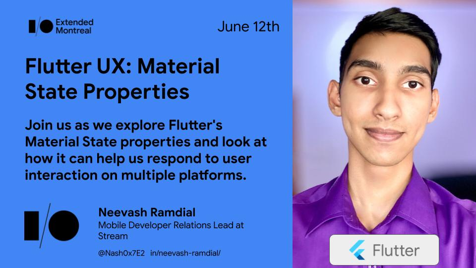

## Material State 

This repository contains code for my talk on using Flutter's new `MaterialStateProperty`. 

The repo contains two branches, `master` which contains an implementation using gesture widgets such as `MouseRegion` and 
`nash/using-material-state` which contains an implementation using [MaterialState](https://api.flutter.dev/flutter/material/MaterialStateProperty-class.html).

Session abstract and talk information can be found on the GDG Montreal website linked [here](https://gdgmontreal.com/2021/05/25/google-io-extended-2021/).

Happy Hacking!
 

Twitter: [Nash0x7E2](https://twitter.com/Nash0x7E2)